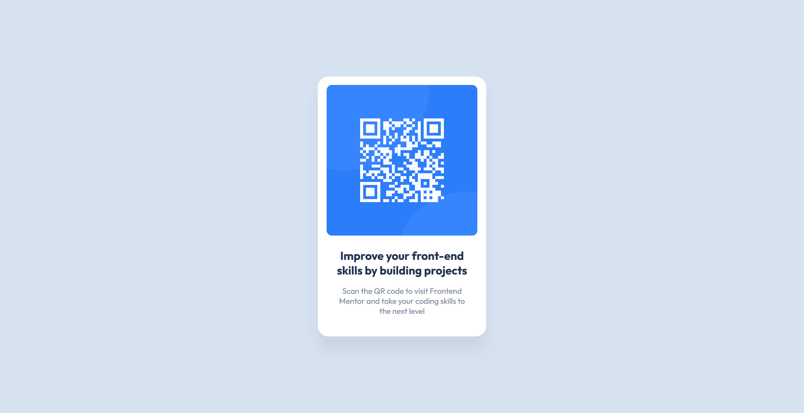

# Frontend Mentor - QR code component solution

This is a solution to the [QR code component challenge on Frontend Mentor](https://www.frontendmentor.io/challenges/qr-code-component-iux_sIO_H). Frontend Mentor challenges help you improve your coding skills by building realistic projects.

## Table of contents

- [Overview](#overview)
  - [Screenshot](#screenshot)
  - [Links](#links)
- [My process](#my-process)
  - [Built with](#built-with)
  - [What I learned](#what-i-learned)
- [Author](#author)

**Note: Delete this note and update the table of contents based on what sections you keep.**

## Overview

### Screenshot

### Links

- Solution URL: [Add solution URL here](https://github.com/Ibtehaj-Ali-1/QR-code-component)
- Live Site URL: [Add live site URL here](https://qr-code-component-eight-gules.vercel.app/)

## My process

### Built with

- Semantic HTML5 markup
- CSS custom properties
- Flexbox

### What I learned

I learned a lot about CSS Flex property, margins & paddings.

## Author

- Website - [Ibtehaj Ali](https://github.com/Ibtehaj-Ali-1)
- Frontend Mentor - [@yourusername](https://www.frontendmentor.io/profile/Ibtehaj-Ali-1)
